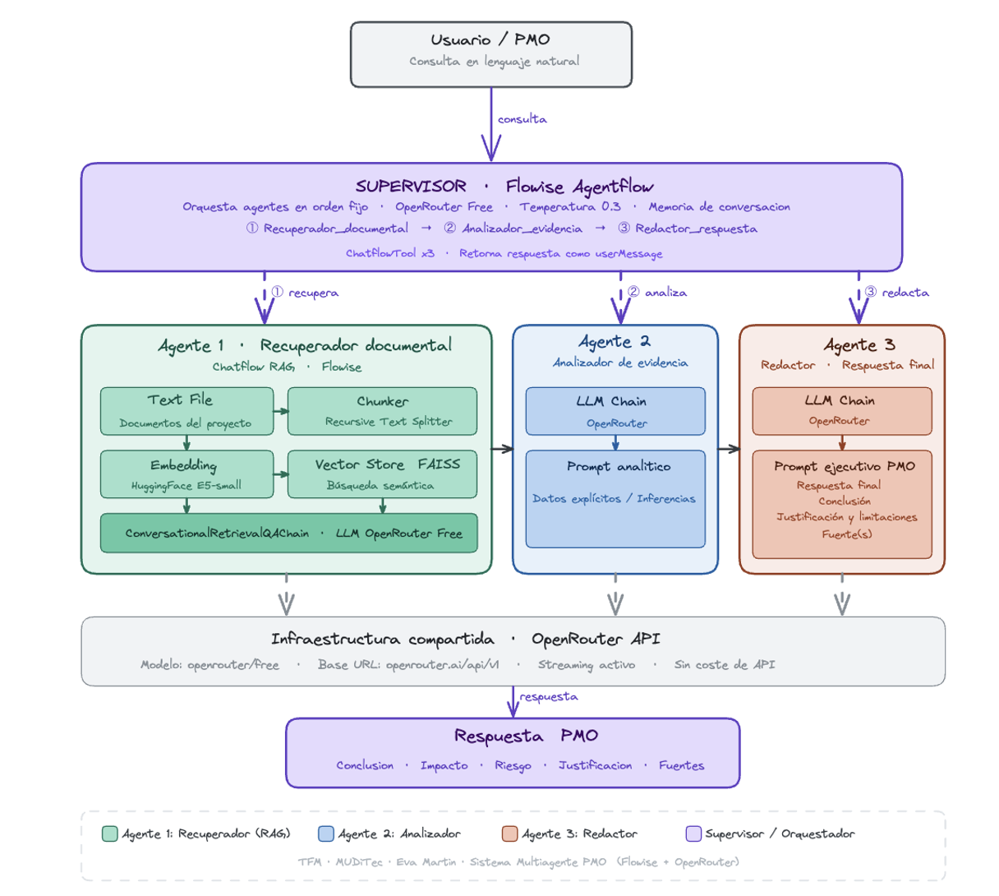

# Sistema multiagente con LLMs para análisis documental de proyectos

Prueba de concepto de un **sistema multiagente basado en modelos de lenguaje de gran escala (LLMs)** para el análisis documental de proyectos y el apoyo a la toma de decisiones en entornos de PMO, consultoría tecnológica y gestión documental.

Este repositorio recoge la implementación técnica desarrollada en el marco del Trabajo Fin de Máster **“Orquestación de sistemas multiagente basados en LLMs para la automatización inteligente de procesos empresariales”**.

## Problema abordado

En muchos proyectos, la información relevante se encuentra repartida entre actas, registros de riesgos, incidencias, presupuestos, facturas y correos de proveedores. Revisar manualmente toda esta documentación consume tiempo, puede generar omisiones y dificulta la preparación de respuestas ejecutivas para dirección o PMO.

El sistema propuesto busca reducir esa carga mediante una arquitectura multiagente capaz de recuperar evidencia documental, analizarla y generar una respuesta final estructurada.

## Solución propuesta

El prototipo se ha implementado en **Flowise** y sigue una arquitectura modular basada en agentes especializados:

1. **Agente recuperador documental**: localiza evidencia relevante dentro del corpus documental mediante RAG.
2. **Agente analista de evidencia**: interpreta la evidencia recuperada e identifica riesgos, impacto, limitaciones y suficiencia de información.
3. **Agente sintetizador de respuesta**: redacta la respuesta final en formato ejecutivo.
4. **Agente supervisor**: orquesta el flujo de trabajo entre los agentes anteriores.

## Arquitectura


El sistema se estructura como una arquitectura multiagente coordinada por un supervisor. La consulta del usuario es procesada en lenguaje natural y se deriva secuencialmente hacia tres agentes especializados: recuperación documental, análisis de evidencia y síntesis ejecutiva.



## Tecnologías utilizadas

- Flowise
- Modelos LLM mediante API compatible
- Retrieval-Augmented Generation (RAG)
- FAISS como almacén vectorial
- Embeddings de Hugging Face (`intfloat/multilingual-e5-small`)
- Docker
- Corpus documental simulado

## Estructura del repositorio

```text
flowise_exports/      Flujos exportados desde Flowise en formato JSON
corpus_demo/          Documentación simulada utilizada para validar el sistema
prompts/              Prompts utilizados por cada agente
docs/                 Diagramas, metodología y material de apoyo
demo/                 Preguntas de prueba y ejemplos de salida
production_notes/     Notas sobre limitaciones, escalado y evolución a producción
web-demo/             Página estática de presentación para Vercel
```

## Ejecución local

> Este repositorio no incluye claves API ni credenciales privadas. Para probar el sistema es necesario crear un archivo `.env` propio a partir de `.env.example`.

1. Clonar el repositorio:

```bash
git clone https://github.com/tu-usuario/sistema-multiagente-llm-analisis-documental.git
cd sistema-multiagente-llm-analisis-documental
```

2. Crear el archivo `.env` a partir de `.env.example` y añadir las credenciales necesarias.

3. Levantar Flowise con Docker:

```bash
docker compose up -d
```

4. Abrir Flowise en el navegador:

```text
http://localhost:3000
```

5. Importar los flujos JSON incluidos en `flowise_exports/`.

6. Cargar los documentos incluidos en `corpus_demo/` dentro del agente recuperador documental.

7. Probar las preguntas incluidas en `demo/preguntas_demo.md`.

## Preguntas demo

- Resume el estado actual del proyecto, los riesgos abiertos, las dependencias críticas y el impacto de la factura pendiente.
- Busca en la documentación todos los campos “Número de factura” y devuélvelos junto con su proveedor.
- ¿Qué riesgos abiertos aparecen en la documentación?
- ¿Qué impacto puede tener el retraso de CloudSign en el proyecto?
- Genera una síntesis ejecutiva para PMO con estado, riesgos, impacto y fuentes.

## Limitaciones

Esta implementación es una **prueba de concepto**, no una solución productiva final. Para un uso real sería necesario incorporar:

- autenticación y control de acceso por roles;
- base vectorial persistente y gestionada;
- monitorización y registros de ejecución;
- evaluación automática de respuestas;
- gestión avanzada de errores;
- control de acceso a documentos;
- posible migración parcial a una arquitectura programática con Python, FastAPI o LangGraph si se requiere mayor control.

## Transferibilidad

La solución puede adaptarse a pequeñas consultoras tecnológicas, oficinas de dirección de proyectos, áreas de auditoría interna y departamentos de gestión documental donde la información de proyecto esté dispersa y requiera análisis estructurado.

## Relación con el TFM

El repositorio complementa la memoria académica del TFM, aportando una implementación revisable y reproducible de la prueba de concepto. Incluye los flujos de Flowise, el corpus documental simulado, los prompts utilizados y ejemplos de uso.

## Autora

Eva Martín Rodríguez.
